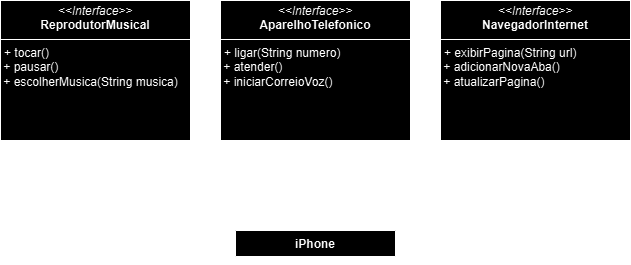

# Desafio UML iPhone (2007)  

## Módulo  

Dominando a Linguagem de Programação Java

## Desafio de projeto

Modelando o iPhone com UML: Funções de Músicas, Chamadas e Internet  

As especificações do projeto podem ser encontradas [aqui](https://github.com/digitalinnovationone/trilha-java-basico/tree/main/desafios/poo)  

## Diagram

Este é o resultado do diagrama desenvolvido

